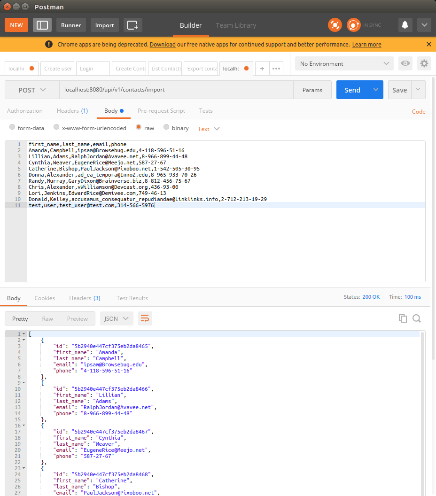

Go Addressbook
=====

Implementation of an addressbook REST api with JWT authentication

[](https://godoc.org/github.com/gocarina/gocsv)
<!-- [](https://travis-ci.org/Dacode45/addressbook) -->

Installation
=====

Requires mongodb. Can install using these instructions:
https://www.digitalocean.com/community/tutorials/how-to-install-mongodb-on-ubuntu-16-04

```go get -u github.com/Dacode45/addressbook```

=====

## Open Endpoints

Open endpoints require no Authentication.

* [Login](docs/login.md) : `POST /api/v1/users/login/`
* [Sign Up](docs/signin.md) : `POST /api/v1/users/`

## Endpoints that require Authentication

Closed endpoints require a valid Token to be included in the header of the
request. A Token can be acquired from the Login view above.

Set token in the authorizaiton header
EX.
`authorization: Bearer <token>`

### Current User related

Each endpoint manipulates or displays information related to the User whose
Token is provided with the request:

* [Me](docs/user/me.md) : `GET /api/v1/users/me`
* [Get User](docs/user/get.md) : `PUT /api/v1/users/:username`

### Contact related

Endpoints for viewing and manipulating the Contacts that the Authenticated User
has permissions to access.

* [Show Accessible Contacts](docs/contacts/get.md) : `GET /api/v1/contacts`
* [Create Contact](docs/contacts/post.md) : `POST /api/v1/contacts`
* [Show An Contact](docs/contacts/pk/get.md) : `GET /api/v1/contacts/:pk`
* [Update An Contact](docs/contacts/pk/put.md) : `PUT /api/v1/contacts/:pk`
* [Delete An Contact](docs/contacts/pk/delete.md) : `DELETE /api/v1/contacts/:pk`
* [Export Contacts](docs/contacts/pk/export.md) : `GET /api/v1/contacts/export`
* [Import Contact](docs/contacts/pk/import.md) : `DELETE /api/v1/contacts/import`

## Walkthrough


Sign Up


Login


Create Contact


Import



Export


List

